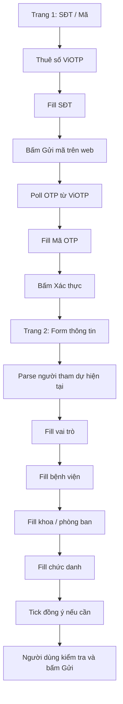
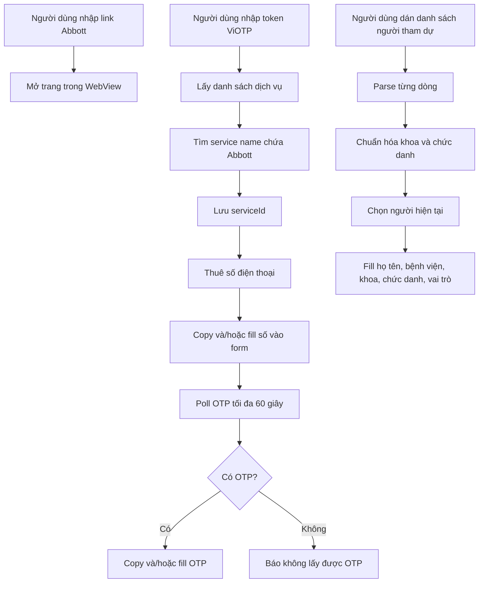
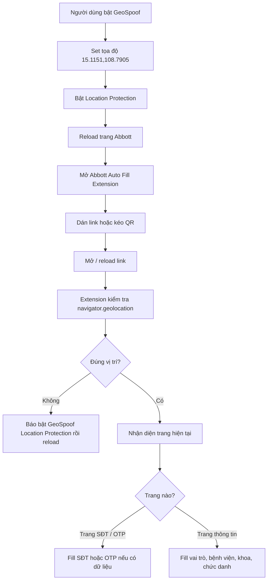

# Mô tả dự án Abbott Event Helper

## 1. Mục tiêu

Dự án dùng để hỗ trợ thao tác đăng ký / điền form sự kiện Abbott nhanh hơn.
Ứng dụng tập trung vào 4 nhóm việc chính:

- Mở trang đăng ký Abbott trong WebView / trình duyệt nhúng.
- Thuê số điện thoại và lấy mã OTP thông qua API ViOTP.
- Parse danh sách người tham dự rồi tự động điền các trường cần thiết vào form.
- Extension Chrome hỗ trợ fake vị trí bằng GeoSpoof, nhập link / kéo QR và auto fill sau khi vị trí đã đúng.

Tài liệu này chỉ mô tả **ý tưởng nghiệp vụ, API, yêu cầu fill, extension và cách parse nội dung**.
Tài liệu này **không mô tả cây thư mục dự án**.

---

## 2. API ViOTP cần giữ lại

### 2.1. Token

Ứng dụng cần một `token` ViOTP để gọi API.
Token được dùng cho tất cả request.

Ví dụ dạng token:

```text
de6faac93d8d4f3294070fe48a11224b
```

> Token thực tế nên cho phép người dùng cấu hình / lưu lại, không nên phụ thuộc cứng vào code.

---

### 2.2. Lấy danh sách dịch vụ

Mục đích: lấy danh sách dịch vụ đang hỗ trợ, sau đó tìm dịch vụ có tên chứa `Abbott`.

Endpoint:

```http
GET https://api.viotp.com/service/getv2?token={TOKEN}&country=vn
```

Tham số:

| Tham số | Ý nghĩa |
|---|---|
| `token` | API token ViOTP |
| `country` | Quốc gia thuê SIM, dùng `vn` cho Việt Nam |

Kết quả cần xử lý:

```json
{
  "status_code": 200,
  "success": true,
  "message": "successful",
  "data": [
    {
      "id": 1,
      "name": "Facebook",
      "price": 800
    }
  ]
}
```

Logic cần giữ:

- Nếu `status_code == 200`, đọc mảng `data`.
- Duyệt từng item trong `data`.
- Tìm item có `name.toLowerCase()` chứa chuỗi `abbott`.
- Lấy `id` của item đó làm `serviceId`.
- Nếu không tìm thấy thì báo lỗi: không tìm thấy dịch vụ Abbott.

---

### 2.3. Thuê số điện thoại

Mục đích: thuê một số điện thoại cho dịch vụ Abbott.

Endpoint:

```http
GET https://api.viotp.com/request/getv2?token={TOKEN}&serviceId={SERVICE_ID}
```

Tham số:

| Tham số | Ý nghĩa |
|---|---|
| `token` | API token ViOTP |
| `serviceId` | ID dịch vụ Abbott lấy từ API danh sách dịch vụ |

Kết quả thành công:

```json
{
  "status_code": 200,
  "success": true,
  "message": "Tạo yêu cầu thành công !",
  "data": {
    "phone_number": "987654321",
    "balance": 50000,
    "request_id": "122314",
    "re_phone_number": "84987654321",
    "countryISO": "VN",
    "countryCode": "84"
  }
}
```

Logic cần giữ:

- Nếu `status_code == 200`:
  - Lấy `data.phone_number`.
  - Nếu số không bắt đầu bằng `0`, thêm `0` vào đầu.
  - Lưu số điện thoại hiện tại.
  - Lưu `data.request_id` để lấy OTP.
  - Copy số điện thoại vào clipboard.
  - Có thể tự điền số vào form web.
- Nếu lỗi thì hiển thị `message` từ API.

Mã lỗi cần lưu ý:

| Mã | Ý nghĩa |
|---|---|
| `200` | Thành công |
| `401` | Lỗi xác thực token |
| `429` | Vượt giới hạn số đang chờ tin nhắn |
| `-1` | Có lỗi chung |
| `-2` | Số dư không đủ |
| `-3` | Kho số tạm hết |
| `-4` | Ứng dụng không tồn tại hoặc tạm ngưng |

---

### 2.4. Lấy mã OTP

Mục đích: kiểm tra phiên thuê số và lấy mã OTP khi có tin nhắn về.

Endpoint:

```http
GET https://api.viotp.com/session/getv2?requestId={REQUEST_ID}&token={TOKEN}
```

Tham số:

| Tham số | Ý nghĩa |
|---|---|
| `requestId` | Mã phiên thuê số lấy ở bước thuê số |
| `token` | API token ViOTP |

Kết quả khi có OTP:

```json
{
  "status_code": 200,
  "success": true,
  "message": "successful",
  "data": {
    "Status": 1,
    "Code": "486460",
    "SmsContent": "486460 la ma xac thuc OTP...",
    "PhoneOriginal": "0987654321"
  }
}
```

Logic cần giữ:

- Chỉ gọi lấy OTP khi đã có `request_id`.
- Poll API trong khoảng 60 giây.
- Mỗi giây gọi API một lần.
- Nếu `status_code == 200`:
  - Đọc `data.Status`.
  - Nếu `Status == 1`:
    - Lấy `data.Code` làm OTP.
    - Copy OTP vào clipboard.
    - Tự điền OTP vào form web nếu có thể.
    - Kết thúc vòng chờ.
  - Nếu `Status == 0`:
    - Tiếp tục chờ.
  - Nếu status khác `0` và `1`:
    - Xem như phiên lỗi / hết hạn.
- Nếu quá 60 giây chưa có OTP thì báo không lấy được OTP.

Trạng thái OTP:

| Status | Ý nghĩa |
|---|---|
| `0` | Đang chờ tin nhắn |
| `1` | Đã nhận OTP |
| `2` | Hết hạn |

---

## 3. Yêu cầu fill form Abbott

Ứng dụng cần tự động điền hoặc hỗ trợ copy các trường sau:

| Trường trên form | Giá trị cần điền |
|---|---|
| Số điện thoại | Số thuê từ ViOTP, thêm `0` ở đầu nếu API trả về 9 số |
| OTP / Mã xác thực | Mã `Code` lấy từ API ViOTP |
| Họ và tên | Parse từ danh sách nội dung |
| Bệnh viện | `BENH VIEN DA KHOA TINH QUANG NGAI` |
| Phòng ban / Khoa | Parse và chuẩn hóa từ danh sách nội dung |
| Chức danh | Parse và chuẩn hóa từ danh sách nội dung |
| Vai trò | `Người tham dự` |

Các thao tác cần hỗ trợ:

- Lấy số điện thoại.
- Copy số điện thoại.
- Điền số điện thoại vào form.
- Lấy OTP.
- Copy OTP.
- Điền OTP vào form.
- Chọn người tham dự hiện tại.
- Điền thông tin người tham dự hiện tại.
- Chuyển sang người tiếp theo.

---

## 4. Cấu trúc 2 trang HTML Abbott

Dựa trên HTML mẫu, luồng Abbott có 2 trang chính cần xử lý.

### 4.1. Trang 1: Xác thực số điện thoại và OTP

Trang đầu là trang đăng nhập / xác thực bằng số điện thoại.
Trong HTML mẫu, trang này có các thành phần chính:

| Thành phần | Nhãn / text trong HTML | Ghi chú |
|---|---|---|
| Ô số điện thoại | `SĐT` | `input` text, `minlength=9`, `maxlength=10` |
| Ô mã xác thực | `Mã` | `input` tel, `maxlength=6`, `autocomplete=one-time-code` |
| Nút gửi mã | `Gửi mã` | Bấm sau khi đã điền SĐT nếu cần request OTP từ web |
| Nút xác thực | `Xác thực` | Bấm sau khi đã điền OTP |

Yêu cầu xử lý trang 1:

1. Thuê số từ ViOTP.
2. Chuẩn hóa số:
   - API ViOTP thường trả về 9 chữ số, không có `0` đầu.
   - Ứng dụng phải thêm `0` ở đầu trước khi fill vào ô `SĐT`.
3. Fill số vào ô có label `SĐT`.
4. Người dùng hoặc tool bấm `Gửi mã` trên web.
5. Ứng dụng poll ViOTP để lấy OTP.
6. Fill OTP vào ô có label `Mã`.
7. Người dùng kiểm tra và bấm `Xác thực`.

Từ khóa nhận diện riêng cho trang 1:

| Dữ liệu | Từ khóa / dấu hiệu |
|---|---|
| Số điện thoại | `sdt`, `SĐT`, `so dien thoai`, `phone`, input có `maxlength=10` |
| OTP | `ma`, `Mã`, `otp`, `code`, `xac thuc`, input có `maxlength=6`, `one-time-code` |
| Nút gửi mã | `gui ma`, `Gửi mã` |
| Nút xác thực | `xac thuc`, `Xác thực` |

> Lưu ý: Trang 1 chỉ cần điền SĐT và OTP. Không fill họ tên, khoa, chức danh ở trang này.

---

### 4.2. Trang 2: Fill thông tin người tham dự

Trang thứ hai là form đăng ký thông tin người tham dự.
HTML mẫu thể hiện các trường / lựa chọn chính sau:

| Thành phần | Text / placeholder trong HTML | Giá trị cần fill |
|---|---|---|
| Vai trò | `Vui lòng nhập vai trò của bạn` | `Nguoi tham du` / `Người tham dự` |
| Bệnh viện | `Vui lòng tìm kiếm tên Bệnh viện và chọn từ danh sách.` | `BENH VIEN DA KHOA TINH QUANG NGAI` |
| Phòng ban / Khoa | `Vui lòng nhập tên phòng ban` | Khoa đã parse và chuẩn hóa |
| Chức danh | `Vui lòng nhập chức danh của bạn` | Chức danh đã parse và chuẩn hóa |
| Checkbox đồng ý | `Đồng ý và chấp nhận` | Cần tick trước khi gửi nếu form yêu cầu |
| Chính sách | `CHÍNH SÁCH VỀ QUYỀN RIÊNG TƯ` | Text tham chiếu, không cần fill |
| Nút gửi | `Gửi` | Người dùng tự kiểm tra rồi bấm gửi |

Các option quan trọng xuất hiện trong HTML:

| Nhóm | Option cần dùng |
|---|---|
| Vai trò | `Nguoi tham du` |
| Khoa | Danh sách nhiều khoa, ví dụ `Khoa Ngoai Tong Quat`, `Khoa Noi Tieu Hoa`, `Khoa phau thuat than kinh`, ... |
| Chức danh | `Bac Sy Dieu Tri`, `Y ta/ Dieu duong`, `Y Ta Truong/ Dieu Duong Truong`, ... |

Yêu cầu xử lý trang 2:

1. Parse người hiện tại từ danh sách nội dung.
2. Fill / chọn vai trò là `Người tham dự`.
3. Fill / chọn bệnh viện cố định.
4. Fill / chọn khoa theo dữ liệu đã chuẩn hóa.
5. Fill / chọn chức danh theo dữ liệu đã chuẩn hóa.
6. Tick checkbox đồng ý nếu cần.
7. Không tự gửi form nếu chưa có xác nhận; để người dùng kiểm tra rồi tự bấm `Gửi`.

Từ khóa nhận diện riêng cho trang 2:

| Dữ liệu | Từ khóa / dấu hiệu |
|---|---|
| Vai trò | `vai tro`, `role`, `Vui lòng nhập vai trò của bạn` |
| Bệnh viện | `benh vien`, `hospital`, `tìm kiếm tên Bệnh viện` |
| Khoa / Phòng ban | `phong ban`, `khoa`, `department`, `tên phòng ban` |
| Chức danh | `chuc danh`, `title`, `chức danh của bạn` |
| Đồng ý | `dong y`, `chap nhan`, `privacy`, `quyen rieng tu` |
| Gửi | `gui`, `submit`, `Gửi` |

---

### 4.3. Luồng qua 2 trang



---

## 5. Cách nhận diện trường trên web để fill

Khi fill tự động vào trang web, ứng dụng nên tìm các thẻ:

```text
input, textarea
```

Sau đó nhận diện trường dựa trên text liên quan tới input:

- `label[for=id]`
- text của các phần tử cha gần input
- `placeholder`
- `name`
- `id`

Trước khi so khớp, text cần được chuẩn hóa:

- Chuyển về chữ thường.
- Bỏ dấu tiếng Việt.
- Đổi `đ` thành `d`.
- Gom nhiều khoảng trắng thành một khoảng trắng.
- Trim đầu/cuối.

Các nhóm từ khóa nhận diện:

| Dữ liệu | Từ khóa nhận diện |
|---|---|
| Số điện thoại | `sdt`, `so dien thoai`, `dien thoai`, `phone` |
| OTP | `ma`, `otp`, `code`, `xac thuc` |
| Họ tên | `ho va ten`, `ho ten`, `name` |
| Bệnh viện | `benh vien`, `hospital` |
| Khoa / Phòng ban | `phong ban`, `khoa`, `department` |
| Chức danh | `chuc danh`, `title` |
| Vai trò | `vai tro`, `role` |

Khi tìm thấy input phù hợp:

- Focus vào input.
- Set `value`.
- Dispatch event `input`.
- Dispatch event `change`.

---

## 6. Định dạng nội dung người tham dự

Danh sách người tham dự nhập theo từng dòng.
Mỗi dòng có format:

```text
Họ tên - Khoa/Phòng ban - Chức danh
```

Ví dụ:

```text
Huỳnh Thị Việt Trinh - Khoa Ngoai Than Kinh - Dieu Duong
Võ Hoàng Xuân Vinh - Ngoai Tong Hop - Dieu Duong
Đỗ Trần Mai Quỳnh - Ngoai Tong Hop - Bac Sy Dieu Tri
Nguyễn Thị Phường - Noi Tong Hop - Dieu Duong Truong
```

Ý nghĩa từng phần:

| Vị trí | Nội dung | Bắt buộc |
|---|---|---|
| Phần 1 | Họ tên | Có |
| Phần 2 | Khoa / phòng ban | Có |
| Phần 3 | Chức danh | Không bắt buộc nhưng nên có |

Ký tự phân cách là dấu gạch ngang:

```text
-
```

Nếu dòng rỗng thì bỏ qua.
Nếu dòng không đủ ít nhất 2 phần thì bỏ qua.

---

## 7. Cách parse nội dung

### 7.1. Parse từng dòng

Thuật toán:

1. Tách toàn bộ nội dung theo `\n`.
2. Duyệt từng dòng.
3. Bỏ qua dòng rỗng.
4. Tách dòng theo dấu `-`.
5. Nếu có ít nhất 2 phần:
   - `name = parts[0].trim()`
   - `rawDepartment = parts[1].trim()`
   - `rawRole = parts.length > 2 ? parts[2].trim() : ''`
6. Chuẩn hóa khoa bằng hàm format khoa.
7. Chuẩn hóa chức danh bằng hàm format chức danh.
8. Thêm vào danh sách người tham dự.

Dữ liệu sau khi parse nên có dạng:

```json
{
  "name": "Huỳnh Thị Việt Trinh",
  "department": "Khoa Ngoai Than Kinh",
  "role": "Dieu Duong",
  "rawDepartment": "Khoa Ngoai Than Kinh",
  "rawRole": "Dieu Duong"
}
```

---

### 7.2. Hàm bỏ dấu tiếng Việt

Mục đích:

- Giúp so khớp dữ liệu ổn định hơn.
- Tránh lệch giữa dữ liệu có dấu và không dấu.
- Dùng cho cả parse khoa/chức danh và nhận diện trường web.

Yêu cầu:

- Thay các nguyên âm tiếng Việt có dấu về dạng không dấu.
- Thay `đ` thành `d`, `Đ` thành `D`.
- Trim chuỗi.
- Gom nhiều khoảng trắng thành một khoảng trắng.

Ví dụ:

| Input | Output |
|---|---|
| `gây mê hồi sức` | `gay me hoi suc` |
| `Khoa Ngoại Thần Kinh` | `Khoa Ngoai Than Kinh` |
| `Điều Dưỡng Trưởng` | `Dieu Duong Truong` |

---

### 7.3. Chuẩn hóa khoa / phòng ban

Sau khi bỏ dấu, chuyển chuỗi về chữ thường để so khớp.

Các rule quan trọng cần giữ:

| Nếu raw chứa | Giá trị chuẩn |
|---|---|
| `gay me` | `Khoa Gay Me Hoi Suc` |
| `ngoai than kinh` | `Khoa Ngoai Than Kinh` |
| `chan thuong` hoặc `chinh hinh` hoặc `bong` | `Khoa Chan Thuong Chinh Hinh - Bong` |

Nếu không match rule đặc biệt:

- Bỏ dấu tiếng Việt.
- Chuyển về title case.

Ví dụ:

| Raw | Kết quả |
|---|---|
| `Ngoai Tong Hop` | `Ngoai Tong Hop` |
| `ngoai tieu hoa` | `Ngoai Tieu Hoa` |
| `nội tổng hợp` | `Noi Tong Hop` |

---

### 7.4. Chuẩn hóa chức danh

Sau khi bỏ dấu, chuyển về chữ thường, bỏ dấu chấm và trim.

Các rule quan trọng cần giữ:

| Nếu raw là / chứa | Giá trị chuẩn |
|---|---|
| `bs` | `Bac Sy Dieu Tri` |
| `bac si` | `Bac Sy Dieu Tri` |
| `bac sy` | `Bac Sy Dieu Tri` |
| chứa `truong` | `Dieu Duong Truong` |
| `dd` | `Dieu Duong` |
| chứa `dieu duong` | `Dieu Duong` |

Nếu không match rule đặc biệt:

- Bỏ dấu tiếng Việt.
- Chuyển về title case.

Ví dụ:

| Raw | Kết quả |
|---|---|
| `bs` | `Bac Sy Dieu Tri` |
| `Bác sĩ` | `Bac Sy Dieu Tri` |
| `dd` | `Dieu Duong` |
| `Điều dưỡng trưởng` | `Dieu Duong Truong` |

---

## 8. Dữ liệu cố định cần giữ

Các giá trị cố định đang dùng trong nghiệp vụ:

| Biến / ý nghĩa | Giá trị |
|---|---|
| Bệnh viện | `BENH VIEN DA KHOA TINH QUANG NGAI` |
| Vai trò | `Người tham dự` |
| Quốc gia API ViOTP | `vn` |
| Thời gian chờ OTP | `60` giây |
| Chu kỳ poll OTP | `1` giây |
| Từ khóa tìm dịch vụ | `abbott` |

---

## 9. Luồng xử lý tổng quát



---

## 10. Ghi chú phát triển tiếp

Các ý nên giữ nếu phát triển phiên bản sau:

- Cho phép cấu hình token ViOTP.
- Tự lưu token, link gần nhất và nội dung người tham dự.
- Không tự submit form, chỉ fill dữ liệu để người dùng kiểm tra rồi tự gửi.
- Khi fill web cần dispatch cả `input` và `change` để tương thích form frontend.
- Cần hiển thị trạng thái rõ ràng khi đang chờ OTP.
- Cần có nút copy thủ công cho số điện thoại, OTP và thông tin người tham dự.

---

## 11. Extension Auto Fill và fake vị trí

Extension là một phần riêng của dự án, dùng cho luồng chạy trên Chrome / Edge.
Mục tiêu của extension là:

- Cho phép người dùng dán link Abbott.
- Cho phép kéo ảnh QR để đọc link nếu trình duyệt hỗ trợ `BarcodeDetector`.
- Kiểm tra vị trí trình duyệt trước khi auto fill.
- Chỉ auto fill sau khi vị trí đã được chuyển về Bệnh viện Đa khoa tỉnh Quảng Ngãi.

### 11.1. GeoSpoof

Dùng extension GeoSpoof từ GitHub:

```text
https://github.com/anthonysgro/geospoof.git
```

GeoSpoof cần được cấu hình tọa độ:

```text
Latitude: 15.1151
Longitude: 108.7905
```

Địa chỉ tương ứng:

```text
Bệnh viện Đa khoa tỉnh Quảng Ngãi,
Trần Tế Xương, Trần Phú,
Phường Nghĩa Lộ, Tỉnh Quảng Ngãi, Việt Nam
```

Yêu cầu bắt buộc:

1. Cài hoặc load GeoSpoof.
2. Nhập tọa độ `15.1151, 108.7905`.
3. Bật **Location Protection**.
4. Reload trang Abbott.
5. Sau khi reload mới chạy auto fill.

> Extension Auto Fill phải kiểm tra `navigator.geolocation` trước khi fill. Nếu vị trí chưa đúng hoặc chưa bật Location Protection thì dừng lại và báo người dùng bật GeoSpoof rồi reload.

---

### 11.2. Extension Abbott Auto Fill

Extension Abbott Auto Fill cần có popup riêng với các chức năng:

| Chức năng | Mô tả |
|---|---|
| Nhập link | Người dùng dán link Abbott trực tiếp |
| Kéo QR | Người dùng kéo ảnh QR vào popup để lấy link |
| Mở / reload link | Mở link Abbott hoặc reload tab hiện tại |
| Lưu dữ liệu | Lưu danh sách người tham dự và link |
| Auto fill trang hiện tại | Fill trang đang mở nếu vị trí đã đúng |
| Người tiếp theo | Chuyển sang người tham dự kế tiếp rồi fill |

Luồng extension:



---

### 11.3. Rule kiểm tra vị trí

Extension dùng `navigator.geolocation.getCurrentPosition()` để lấy vị trí trình duyệt.
Sau đó tính khoảng cách tới tọa độ yêu cầu.

Điều kiện hợp lệ:

```text
Khoảng cách tới 15.1151, 108.7905 <= 350 mét
```

Nếu khoảng cách lớn hơn ngưỡng trên:

- Không fill.
- Hiển thị lỗi: chưa đúng vị trí BVĐK Quảng Ngãi.
- Yêu cầu bật GeoSpoof Location Protection.
- Yêu cầu reload lại trang Abbott.

---

### 11.4. Auto fill sau khi đúng vị trí

Sau khi vị trí hợp lệ, extension mới nhận diện trang:

| Trang | Dấu hiệu | Hành động |
|---|---|---|
| Trang 1 | Có `SĐT`, `Mã`, `Gửi mã`, `Xác thực` | Fill SĐT / OTP nếu đã có dữ liệu |
| Trang 2 | Có `vai trò`, `bệnh viện`, `phòng ban`, `chức danh` | Fill thông tin người tham dự |

Extension không tự submit form.
Người dùng vẫn cần kiểm tra lại dữ liệu rồi tự bấm `Xác thực` hoặc `Gửi`.
